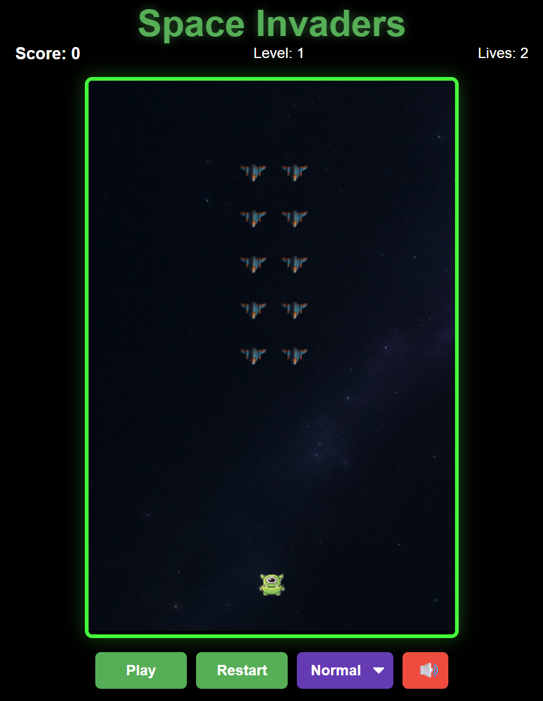

# Space Invaders - Modern Edition



A modern take on the classic Space Invaders game, built with Phaser 3. This version features a portrait layout, responsive design, and enhanced gameplay mechanics.

## 🚀 Features

- 🎮 Classic Space Invaders gameplay with a modern twist
- 📱 Portrait mode for better mobile experience
- 🎵 Background music and sound effects
- ⚙️ Adjustable difficulty levels (Easy, Normal, Hard)
- ⏯️ Play/Pause functionality
- 🎨 Modern UI with smooth animations

## 🛠️ Prerequisites

- Node.js (v14 or higher recommended)
- A modern web browser (Chrome, Firefox, Edge, Safari)
- Python 3.x (for local development server)

## 🚀 Getting Started

### Installation

1. Clone the repository:
   ```bash
   git clone https://github.com/yourusername/space-invaders.git
   cd space-invaders
   ```

2. Install dependencies (if any):
   ```bash
   npm install
   ```

### Running the Game

#### Option 1: Using Python's HTTP Server
```bash
# Navigate to the project directory
cd path/to/space-invaders

# Start the server (Python 3)
python -m http.server 8000

# Open your browser and visit:
# http://localhost:8000
```

#### Option 2: Using Live Server (VS Code Extension)
1. Install the "Live Server" extension in VS Code
2. Right-click on `index.html` and select "Open with Live Server"

## 🎮 How to Play

### Controls
- **Left/Right Arrow Keys**: Move your spaceship
- **Spacebar**: Shoot at the invaders
- **Pause/Play Button**: Pause or resume the game
- **Restart Button**: Start a new game
- **Difficulty Selector**: Choose game difficulty (Easy, Normal, Hard)
- **Mute Button**: Toggle sound on/off

### Game Rules
1. Shoot and destroy the descending invaders before they reach the bottom
2. Avoid getting hit by the invaders' bullets
3. Clear all invaders to advance to the next level
4. The game ends if you lose all three lives

## 🎯 Features in Detail

### Difficulty Levels
- **Easy**: Slower invaders, less frequent shooting
- **Normal**: Balanced gameplay
- **Hard**: Faster invaders, more aggressive AI

### Power-ups
- Coming soon! (Future update)

## 📁 Project Structure

```
space-invaders/
├── assets/
│   ├── audio/         # Sound effects and music
│   ├── images/        # Game sprites and backgrounds
│   └── screenshot.png # Game screenshot
├── index.html        # Main HTML file
├── game.js           # Game logic and Phaser configuration
└── README.md         # This file
```

## 🤝 Contributing

Contributions are welcome! Please feel free to submit a Pull Request.

## 📄 License

This project is licensed under the MIT License - see the [LICENSE](LICENSE) file for details.

## 🙏 Acknowledgments

- Built with [Phaser 3](https://phaser.io/)
- Inspired by the classic Space Invaders game
- Sound effects from [freesound.org](https://freesound.org/)

---

🎮 **Happy Gaming!** If you enjoy this game, consider giving it a ⭐ on GitHub!
